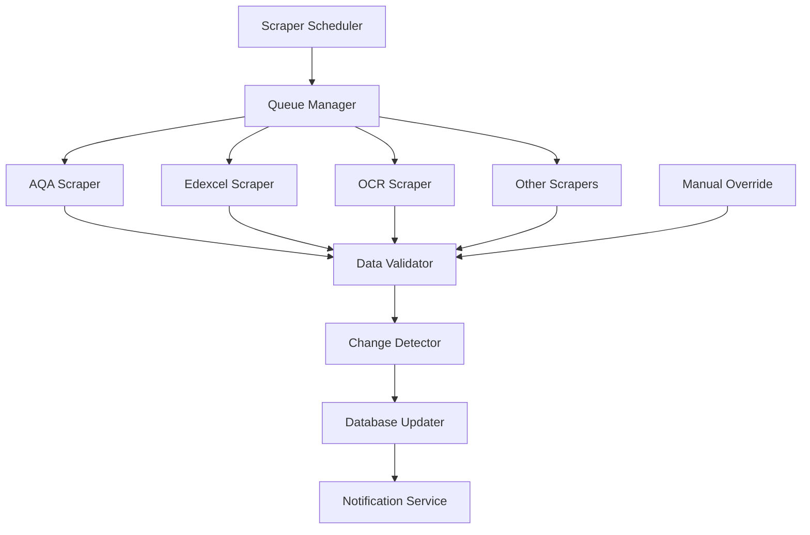

# 📚 Exam Board Data Strategy & Architecture

## What is Expo?

**Expo** is a framework and platform for universal React applications. Think of it as:
- **React Native + Extra Tools**: Builds on React Native but adds many conveniences
- **Write Once, Run Everywhere**: Same code works on iOS, Android, and Web
- **No Native Setup Required**: You can build iOS apps on Windows/Linux
- **Instant Testing**: Test on your phone instantly with Expo Go app
- **Managed Workflow**: Handles complex native configurations for you

**Benefits for your project:**
- 🚀 **Faster Development**: No Xcode/Android Studio setup needed
- 📱 **Easy Testing**: Share demo link, testers scan QR code
- 🌐 **Web Support**: Deploy to web immediately
- 🔧 **OTA Updates**: Push updates without app store approval

## 🎯 Exam Board Data Architecture

### Current UK Exam Boards to Support

1. **AQA** (Assessment and Qualifications Alliance)
2. **Edexcel** (Pearson)
3. **OCR** (Oxford, Cambridge and RSA)
4. **WJEC** (Welsh Joint Education Committee)
5. **EDUQAS** (WJEC brand for England)
6. **CCEA** (Council for Curriculum, Examinations & Assessment - NI)
7. **SQA** (Scottish Qualifications Authority)
8. **Cambridge International** (CIE)

### Database Schema for Exam Board Data

```sql
-- Core exam board reference table
CREATE TABLE exam_boards (
    id UUID PRIMARY KEY DEFAULT uuid_generate_v4(),
    code TEXT UNIQUE NOT NULL, -- 'AQA', 'EDEXCEL', etc.
    full_name TEXT NOT NULL,
    country TEXT NOT NULL, -- 'UK', 'International'
    website_url TEXT,
    logo_url TEXT,
    active BOOLEAN DEFAULT true,
    created_at TIMESTAMPTZ DEFAULT NOW(),
    updated_at TIMESTAMPTZ DEFAULT NOW()
);

-- Qualification types (GCSE, A-Level, etc.)
CREATE TABLE qualification_types (
    id UUID PRIMARY KEY DEFAULT uuid_generate_v4(),
    code TEXT UNIQUE NOT NULL, -- 'GCSE', 'A_LEVEL', 'IB'
    name TEXT NOT NULL,
    level INTEGER, -- Academic level (1-5)
    created_at TIMESTAMPTZ DEFAULT NOW()
);

-- Subjects offered by exam boards
CREATE TABLE exam_board_subjects (
    id UUID PRIMARY KEY DEFAULT uuid_generate_v4(),
    exam_board_id UUID REFERENCES exam_boards(id),
    qualification_type_id UUID REFERENCES qualification_types(id),
    subject_code TEXT NOT NULL, -- Board's subject code
    subject_name TEXT NOT NULL,
    specification_code TEXT, -- e.g., '8300' for AQA GCSE Maths
    specification_url TEXT, -- Direct link to PDF/webpage
    first_teaching DATE,
    first_exam DATE,
    last_exam DATE, -- For phasing out specs
    version TEXT, -- Specification version
    is_current BOOLEAN DEFAULT true,
    created_at TIMESTAMPTZ DEFAULT NOW(),
    updated_at TIMESTAMPTZ DEFAULT NOW(),
    UNIQUE(exam_board_id, qualification_type_id, subject_code)
);

-- Detailed curriculum structure
CREATE TABLE curriculum_topics (
    id UUID PRIMARY KEY DEFAULT uuid_generate_v4(),
    exam_board_subject_id UUID REFERENCES exam_board_subjects(id),
    parent_topic_id UUID REFERENCES curriculum_topics(id), -- For hierarchy
    topic_code TEXT, -- Board's topic code (e.g., '4.1.2')
    topic_name TEXT NOT NULL,
    topic_level INTEGER, -- 1=Module, 2=Topic, 3=Subtopic
    description TEXT,
    learning_objectives JSONB, -- Array of objectives
    assessment_weight DECIMAL(5,2), -- Percentage weight in exam
    teaching_hours INTEGER, -- Recommended hours
    prerequisites JSONB, -- Array of prerequisite topic IDs
    resources JSONB, -- Links to official resources
    metadata JSONB, -- Additional board-specific data
    sort_order INTEGER,
    created_at TIMESTAMPTZ DEFAULT NOW(),
    updated_at TIMESTAMPTZ DEFAULT NOW()
);

-- Track scraping history
CREATE TABLE scrape_logs (
    id UUID PRIMARY KEY DEFAULT uuid_generate_v4(),
    exam_board_id UUID REFERENCES exam_boards(id),
    scrape_type TEXT, -- 'full', 'incremental', 'check'
    status TEXT, -- 'running', 'completed', 'failed'
    started_at TIMESTAMPTZ DEFAULT NOW(),
    completed_at TIMESTAMPTZ,
    records_added INTEGER DEFAULT 0,
    records_updated INTEGER DEFAULT 0,
    records_removed INTEGER DEFAULT 0,
    error_log JSONB,
    metadata JSONB -- Store scrape configuration
);

-- Version tracking for curriculum changes
CREATE TABLE curriculum_versions (
    id UUID PRIMARY KEY DEFAULT uuid_generate_v4(),
    exam_board_subject_id UUID REFERENCES exam_board_subjects(id),
    version_date DATE NOT NULL,
    change_summary TEXT,
    change_details JSONB,
    created_at TIMESTAMPTZ DEFAULT NOW()
);

-- Indexes for performance
CREATE INDEX idx_curriculum_topics_board_subject ON curriculum_topics(exam_board_subject_id);
CREATE INDEX idx_curriculum_topics_parent ON curriculum_topics(parent_topic_id);
CREATE INDEX idx_exam_board_subjects_current ON exam_board_subjects(is_current) WHERE is_current = true;
```

## 🕷️ Web Scraping Strategy

### Architecture Overview



### Scraper Implementation

```typescript
// Base scraper class
abstract class ExamBoardScraper {
  protected examBoardId: string;
  protected baseUrl: string;
  protected rateLimitMs: number = 2000; // Be respectful
  
  abstract async scrapeSubjects(): Promise<Subject[]>;
  abstract async scrapeCurriculum(subjectId: string): Promise<Topic[]>;
  
  async run(): Promise<ScrapeResult> {
    const startTime = Date.now();
    const results = {
      added: 0,
      updated: 0,
      removed: 0,
      errors: []
    };
    
    try {
      // 1. Scrape all subjects
      const subjects = await this.scrapeSubjects();
      
      // 2. For each subject, scrape curriculum
      for (const subject of subjects) {
        await this.delay(this.rateLimitMs);
        const topics = await this.scrapeCurriculum(subject.id);
        
        // 3. Detect changes and update
        const changes = await this.detectChanges(subject, topics);
        await this.applyChanges(changes);
        
        results.added += changes.added.length;
        results.updated += changes.updated.length;
        results.removed += changes.removed.length;
      }
      
      // 4. Log completion
      await this.logScrape(results, startTime);
      
    } catch (error) {
      results.errors.push(error);
      await this.logError(error);
    }
    
    return results;
  }
  
  protected async detectChanges(subject: Subject, newTopics: Topic[]) {
    const existingTopics = await this.getExistingTopics(subject.id);
    
    return {
      added: newTopics.filter(t => !existingTopics.find(e => e.code === t.code)),
      updated: newTopics.filter(t => {
        const existing = existingTopics.find(e => e.code === t.code);
        return existing && this.hasChanged(existing, t);
      }),
      removed: existingTopics.filter(e => !newTopics.find(t => t.code === e.code))
    };
  }
}

// Example: AQA Scraper
class AQAScraper extends ExamBoardScraper {
  constructor() {
    super();
    this.examBoardId = 'aqa';
    this.baseUrl = 'https://www.aqa.org.uk';
  }
  
  async scrapeSubjects(): Promise<Subject[]> {
    const subjects = [];
    
    // Scrape GCSE subjects
    const gcseUrl = `${this.baseUrl}/subjects/gcse`;
    const $ = await this.fetchPage(gcseUrl);
    
    $('.subject-list-item').each((i, elem) => {
      subjects.push({
        code: $(elem).data('subject-code'),
        name: $(elem).find('.subject-name').text(),
        qualificationType: 'GCSE',
        specificationUrl: $(elem).find('a.spec-link').attr('href')
      });
    });
    
    return subjects;
  }
  
  async scrapeCurriculum(subjectId: string): Promise<Topic[]> {
    // Download specification PDF or parse HTML
    // Extract topic structure
    // Return normalized topic data
  }
}
```

### Scraping Schedule & Strategy

```typescript
// Scheduled scraping configuration
const SCRAPE_SCHEDULE = {
  // Full scrape: Annual (before academic year)
  full: {
    cronExpression: '0 0 1 7 *', // July 1st, midnight
    examBoards: ['AQA', 'EDEXCEL', 'OCR', 'WJEC', 'EDUQAS', 'CCEA'],
    strategy: 'complete-rebuild'
  },
  
  // Incremental: Monthly (check for updates)
  incremental: {
    cronExpression: '0 2 1 * *', // 1st of each month, 2 AM
    examBoards: ['AQA', 'EDEXCEL', 'OCR'],
    strategy: 'changes-only'
  },
  
  // Quick check: Weekly (verify links still work)
  health: {
    cronExpression: '0 3 * * 1', // Every Monday, 3 AM
    examBoards: 'all',
    strategy: 'link-validation'
  }
};

// Supabase Edge Function for scheduling
export async function scheduledScrape(request: Request) {
  const { schedule } = await request.json();
  
  const scrapeJob = await createScrapeJob({
    type: schedule,
    examBoards: SCRAPE_SCHEDULE[schedule].examBoards,
    strategy: SCRAPE_SCHEDULE[schedule].strategy
  });
  
  // Queue for processing
  await queueScrapeJob(scrapeJob);
  
  return new Response(JSON.stringify({ jobId: scrapeJob.id }));
}
```

## 🔄 Data Update Strategy

### 1. **Change Detection System**
```typescript
interface ChangeDetection {
  // Compare new scraped data with existing
  detectChanges(newData: Topic[], existingData: Topic[]): {
    added: Topic[];
    modified: Topic[];
    removed: Topic[];
  };
  
  // Generate change report
  generateChangeReport(changes: Changes): ChangeReport;
  
  // Notify admins of significant changes
  notifyIfSignificant(report: ChangeReport): Promise<void>;
}
```

### 2. **Version Control**
- Track all changes with timestamps
- Allow rollback if scraping errors occur
- Maintain history of curriculum evolution

### 3. **Manual Override System**
```typescript
// Admin interface for manual corrections
interface ManualOverride {
  // Fix scraping errors
  correctTopic(topicId: string, corrections: Partial<Topic>): Promise<void>;
  
  // Add missing topics
  addManualTopic(topic: Topic): Promise<void>;
  
  // Mark topics as deprecated
  deprecateTopic(topicId: string, reason: string): Promise<void>;
}
```

## 📊 Data Quality Assurance

### Validation Rules
```typescript
const VALIDATION_RULES = {
  topic: {
    nameMinLength: 3,
    nameMaxLength: 200,
    codePattern: /^[A-Z0-9\.\-]+$/,
    requiredFields: ['name', 'code', 'level']
  },
  
  subject: {
    validQualifications: ['GCSE', 'A_LEVEL', 'AS_LEVEL', 'BTEC'],
    requiredFields: ['name', 'code', 'qualification_type']
  }
};

// Validate scraped data
function validateScrapedData(data: any): ValidationResult {
  const errors = [];
  
  // Check required fields
  for (const field of VALIDATION_RULES.topic.requiredFields) {
    if (!data[field]) {
      errors.push(`Missing required field: ${field}`);
    }
  }
  
  // Validate format
  if (data.code && !VALIDATION_RULES.topic.codePattern.test(data.code)) {
    errors.push(`Invalid code format: ${data.code}`);
  }
  
  return {
    valid: errors.length === 0,
    errors
  };
}
```

## 🚀 Implementation Plan

### Phase 1: Data Migration (Week 1)
1. Export your 16,000 records from Knack
2. Create migration script to new schema
3. Validate and import into Supabase
4. Set up data integrity checks

### Phase 2: Scraper Development (Week 2-3)
1. Build base scraper framework
2. Implement AQA scraper (most structured)
3. Add Edexcel and OCR scrapers
4. Test with sample subjects

### Phase 3: Automation (Week 4)
1. Set up Supabase Edge Functions
2. Configure cron jobs
3. Build admin dashboard
4. Implement change notifications

## 💡 Best Practices

1. **Respect Robots.txt**: Always check and follow
2. **Rate Limiting**: 2-3 seconds between requests
3. **User Agent**: Identify your scraper properly
4. **Caching**: Cache unchanged PDFs/pages
5. **Error Handling**: Graceful failures, retry logic
6. **Legal Compliance**: Only scrape public data

## 🔗 API Integration Alternative

Consider reaching out to exam boards for official APIs:
- Some boards offer educator APIs
- More reliable than scraping
- Real-time updates
- Legal clarity

Would you like me to create the specific scraper implementations for each exam board? 